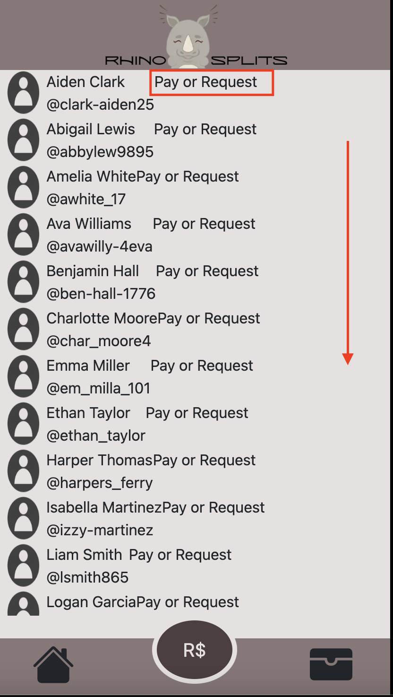
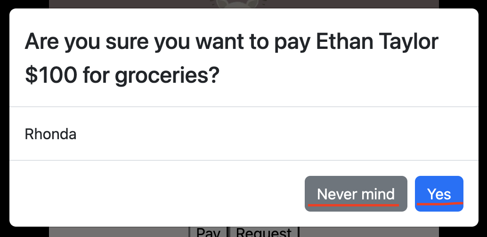
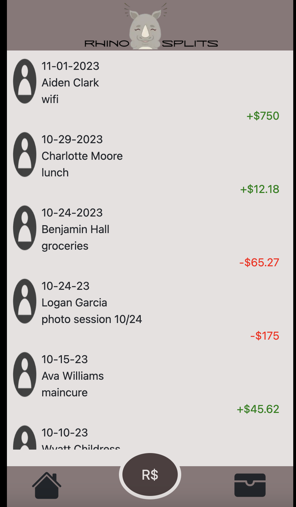
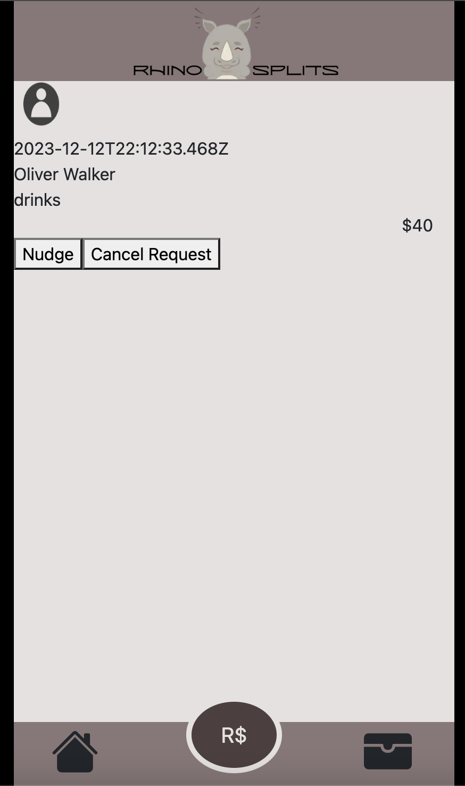

# Rhino Splits - Tori Franklin, FEWDD/E22 Final Capstone

Hi-Fi wireframe: https://www.figma.com/file/PDaldDBi1y3Nv4USV4QpDb/rhino-splits?type=design&node-id=0-1&mode=design&t=wkPzXz8Y8jNbR5pz-0

Hi-Fi Prototype: https://www.figma.com/proto/PDaldDBi1y3Nv4USV4QpDb/rhino-splits?type=design&node-id=0-1&t=wkPzXz8Y8jNbR5pz-0&scaling=scale-down&page-id=0%3A1&starting-point-node-id=1%3A7&show-proto-sidebar=1 

## Overview: Rhino Splits is a peer to peer payment app, with privacy and simplicity as our top priorities. Rhino Splits helps take the awkwardness out of owing your peers money by allowing the user to send and receive payments without needing cash or a card present. Rhino Splits was created over the course of 14 weeks using a research plan heavily consisted of user interviews/testing, as well as online design and prototyping tools.

## Description of user: 18-35, living in larger or more populated metropolitan areas, with rich social and professional lives

## Topics
- [View Friends]
- [Send/Request Payment]
- [View Transaction History]
- [View Pending Requests]
___

### View Friends
#### 1. Once redirected to home page, click on the "Friends" button to view your friends. 

#### 2. Scroll to view all friends. You can also easily send or request a payment from your friends from this screen.

## Send/Request Payment
1. Click the "R$" button at the bottom middle of the screen

1. Select the friend you want to pay/reqeust

1. Enter the description by typing in the form, enter the amount by clicking the corresponding number buttons.

1. Click "Pay" or "Request"
1. Confirm.

### If you have sent a payment or received a payment from a friend, you can view those transactions in your Transaction History.

### If you have sent a request or received a request from a friend, you can view those requests in Your Pending Requests.

### Here, you'll have the option to cancel the request or nudge the user you're requesting.The Nudge feature is still under construction (12/12/23)

**NOTES:** 
- This is V1 of Rhino Splits, MVP
